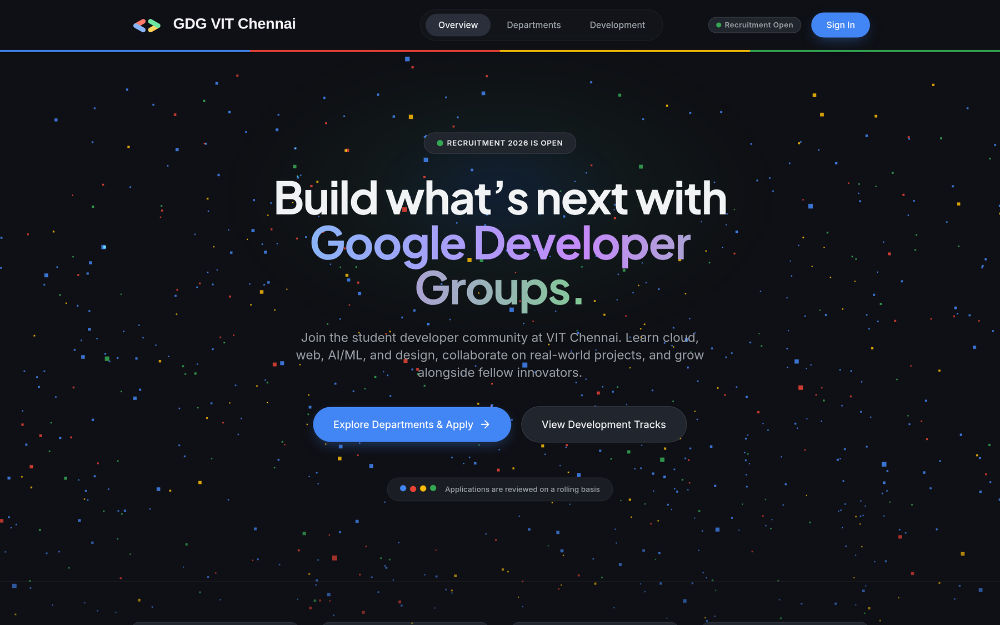

# Recruitment Portal

A recruitment portal for GDG on Campus VIT Chennai — applicants sign in, choose
up to two departments, answer department-specific questions, and the core team
reviews, filters, shortlists and emails candidates from an admin panel.

Next.js 14 (App Router) · Firestore via `firebase-admin` · Better Auth ·
Tailwind + shadcn/ui · react-hook-form + zod



> The landing background is a `three.js` particle field that parallaxes with the
> pointer. It is loaded only on this page and only in the browser, so no other
> route pays for it — see [WORK.md §6](WORK.md#6-user-interface).

---

## Documentation

| Document | What it covers |
|---|---|
| **[WORK.md](WORK.md)** | Every change made and the reasoning behind it |
| **[RUNNING.md](RUNNING.md)** | Setup, manual testing, security verification, deployment |

---

## Quick start

Runs against the Firestore emulator — no Firebase account needed.

```bash
bun install
cp .env.example .env.local        # then set BETTER_AUTH_SECRET (see below)

bun run emulator                  # terminal 1 — Firestore emulator
bun run dev                       # terminal 2 — app on :3000
```

`BETTER_AUTH_SECRET` is required; the app refuses to start without it, by
design. Generate one with `openssl rand -base64 32`.

To reach `/admin`, sign up first, then grant yourself the role and sign back in:

```bash
bun run set-admin you@example.com
```

Full instructions, including the regression check for the response-storage bug,
are in **[RUNNING.md](RUNNING.md)**.

---

## Headline fixes

The full list is in [WORK.md](WORK.md). The ones worth knowing first:

**Answers were silently discarded.** Applicants submitted successfully and the
admin panel showed *Not Answered*. `react-hook-form` parses a field `name` as a
path and splits it on `.`, so questions ending in a full stop were stored under
a key without it, while the submit handler read it back with it. The lookup
missed and an empty string was written. **16 of 24 questions were affected** —
two thirds of every application, failing silently.
→ [WORK.md §1](WORK.md#1-the-response-storage-malfunction)

**The admin page served every applicant's PII to anyone.** The Server Component
read the full collection and passed it to a Client Component that only *then*
checked the role — so the data was already in the browser's payload before
"Access Denied" rendered. Three admin API routes had no authentication at all,
including one that could send arbitrary HTML from the organisation's Gmail
account. Firestore itself allowed public read *and write*.
→ [WORK.md §2](WORK.md#2-security)

**Applicants could shortlist themselves.** The submission endpoint spread every
field of the request body into the document, so a POST containing
`{"shortlisted": true}` was honoured.
→ [WORK.md §2](WORK.md#2-security)

**The portal was closed.** The submission deadline was hardcoded to a date
already in the past, so every submission returned 403.
→ [WORK.md §3](WORK.md#3-correctness-bugs)

**Nine loops burned CPU for nothing.** Heavy computations ran on every render
and discarded the result — the landing page alone did ~54 million wasted float
operations per second while the mouse moved. A 359 MB icon package sat on the
compile path of every route to populate a field nothing rendered; removing it
took `/departments` from 8,784 modules to 968.
→ [WORK.md §4](WORK.md#4-performance)

**The interface was unstyled.** `globals.css` was nine lines and defined none of
the CSS variables the Tailwind config referenced, so every shadcn component
rendered with no styling at all. Rebuilt against a Material 3 dark-theme system
using tonal elevation and the Google palette applied functionally.
→ [WORK.md §6](WORK.md#6-user-interface)

---

## Known gaps

Listed honestly in [WORK.md §8](WORK.md#8-known-gaps) — the main ones are that
`/admin` fetches the entire applicant collection per request with no pagination,
and that the project has no automated tests.
